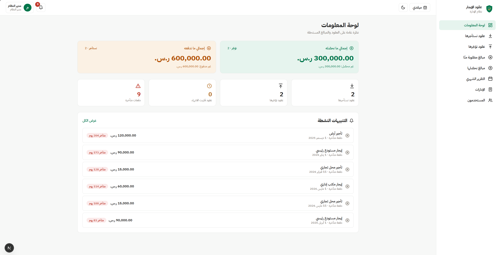
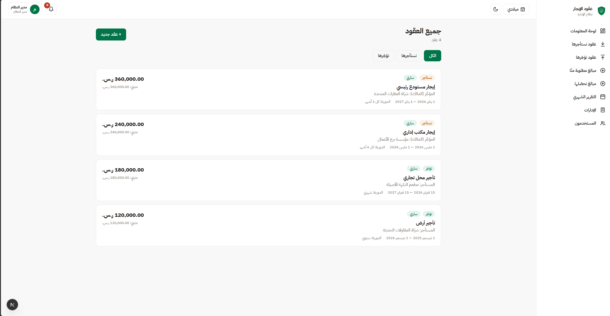
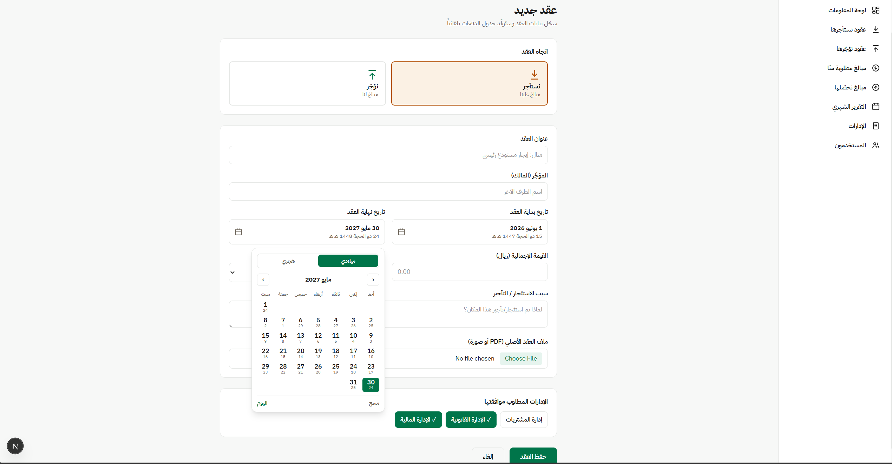
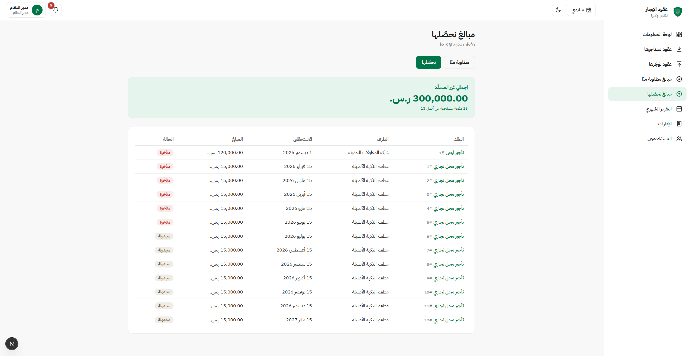
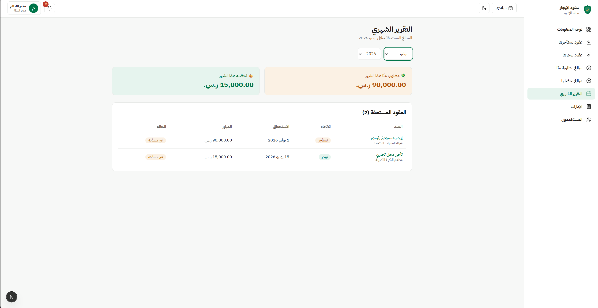
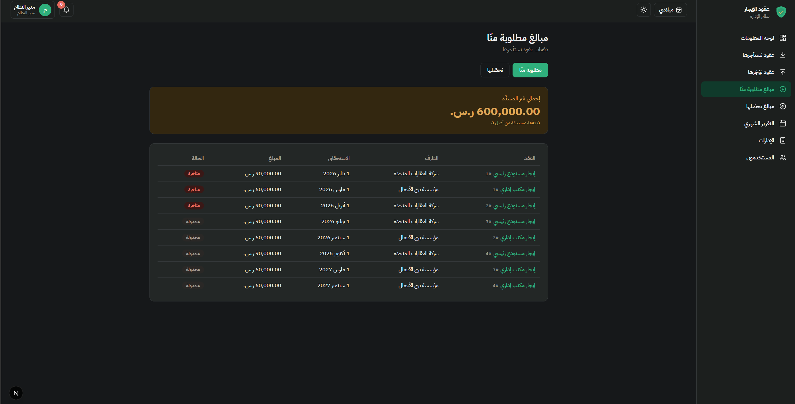

<div align="center">

# نظام إدارة عقود الإيجار
### Lease Management System

نظام متكامل لإدارة عقود الإيجار في الاتجاهين — العقود التي **نستأجرها** (مدفوعات) والعقود التي **نؤجّرها** (محصّلات) — مع توليد جداول الدفعات تلقائياً، وموافقات الإدارات، ودعم التقويمين الهجري والميلادي.

A full-stack, Arabic-first lease management system for organizations that both **rent properties (as tenant)** and **lease them out (as landlord)** — with automatic payment-schedule generation, multi-department approvals, and Hijri/Gregorian calendar support.

[](https://github.com/mosaabalshehri-collab/lease-management-system/actions/workflows/build.yml)


</div>

---

## لمحة سريعة · Overview



لوحة معلومات تعرض إجمالي المبالغ المطلوبة منّا والمبالغ المستحقة لنا بشكل منفصل، مع التنبيهات النشطة (انتهاء العقود واستحقاق الدفعات).

---

## المزايا · Features

- **عقود ثنائية الاتجاه** — كل عقد له اتجاه: `نستأجر` (مدفوعات علينا) أو `نؤجّر` (محصّلات لنا)، مع تمييز لوني واضح بينهما.
- **توليد جداول الدفعات تلقائياً** — من تاريخ البداية والدورية (شهري / كل 3 أشهر / كل 4 / نصف سنوي / سنوي). توزيع المبالغ يتم بالهللات مع وضع فرق التقريب على الدفعة الأخيرة، فيساوي مجموع الدفعات قيمة العقد بالضبط.
- **ثلاثة أدوار وصلاحيات** — مدير النظام (تسجيل العقود والملفات والدفعات)، مستخدم إدارة (يرى عقود إدارته فقط ويوافق/يرفض، والرفض يتطلب سبباً إجبارياً)، ومشاهد عام (قراءة فقط).
- **تقويم هجري/ميلادي** — منتقي تاريخ مخصّص يدعم التبديل بين التقويمين مع عرض التاريخ المقابل، عبر تقويم أم القرى (`Intl`) دون أي مكتبة خارجية. التخزين يبقى ميلادي ISO.
- **تقرير شهري** — اختيار أي شهر لعرض المبالغ المستحقة، مقسّمة حسب الاتجاه.
- **تنبيهات داخل النظام** — قبل انتهاء العقد بـ 30 يوماً، وقبل استحقاق الدفعة بـ 7 أيام (مع تمييز المتأخر).
- **إدارة الإدارات والمستخدمين** — الإدارة المرتبطة بعقود محميّة من الحذف (يُقترح التعطيل بدلاً منه).
- **وضع داكن** — تبديل يدوي بهوية بصرية مصمّمة لراحة القراءة.

---

## لقطات من النظام · Screenshots

### قائمة العقود — التمييز بين ما نستأجره وما نؤجّره


### تسجيل عقد جديد — مع منتقي التاريخ الهجري/الميلادي وتوليد الدفعات


### المبالغ المستحقة — جدول الدفعات بالتقويم الهجري


### التقرير الشهري


### الوضع الداكن · Dark Mode


---

## التقنيات · Tech Stack

| الطبقة | الاختيار |
|---|---|
| Framework | Next.js 15 (App Router) + React 19 |
| Language | TypeScript (strict) |
| Styling | Tailwind CSS v4 |
| Database | SQLite عبر `node:sqlite` المدمج في Node |
| Auth | JWT (httpOnly cookie) + bcrypt |
| Validation | Zod |

بدون ORM وبدون خادم قاعدة بيانات خارجي — كامل طبقة البيانات تعمل على SQLite المدمج في Node، فيبقى المشروع مستقلاً وسهل التشغيل.

---

## التشغيل · Getting Started

> يتطلب **Node.js 22.5 أو أحدث** (لدعم `node:sqlite` المدمج).

```bash
npm install
npm run seed     # ينشئ قاعدة البيانات + الحسابات التجريبية والبيانات الأولية
npm run build
npm start        # http://localhost:3000
```

للتطوير:

```bash
npm run dev
```

### الحسابات التجريبية · Demo Accounts

| الدور | البريد | كلمة المرور |
|---|---|---|
| مدير النظام | `admin@lease.sa` | `Admin@123` |
| مستخدم إدارة | `finance@lease.sa` | `Dept@123` |
| مشاهد عام | `viewer@lease.sa` | `Viewer@123` |

---

## قرارات هندسية · Engineering Decisions

- **الاتجاه كتجريد أساسي.** «نستأجر» مقابل «نؤجّر» مُمثَّل كعمود `direction` واحد بدل كيانين منفصلين، فتشترك لوحة المعلومات والتقارير والقوائم في مسار استعلام واحد ويبقى السلوك متّسقاً.
- **المبالغ بالهللات.** توزيع الدفعات يُحسب بأعداد صحيحة من الهللات (`المبلغ × 100`) لتفادي أخطاء الفاصلة العائمة، ثم يُحوَّل، فيضمن أن مجموع الأقساط يساوي قيمة العقد تماماً.
- **فصل الخادم عن العميل.** الوحدات الخاصة بالخادم (`next/headers`, SQLite) مفصولة عن حِزم العميل؛ والثوابت المشتركة (الأدوار، المسميات) في وحدات آمنة للعميل.
- **ترشيح الصلاحيات في طبقة الاستعلام.** قواعد الرؤية (مستخدم الإدارة يرى عقود إدارته فقط) مطبّقة في شرط `WHERE` في SQL، وليس في الواجهة فقط.
- **تحويل هجري↔ميلادي دون مكتبات.** عبر `Intl` (تقويم أم القرى) مع خوارزمية تصحيح تكراري للتحويل العكسي، مع بقاء التخزين ميلادي ISO للحساب والمقارنة.

---

## الاختبارات · Testing

يتضمّن المشروع سكربتات اختبار شاملة (end-to-end) تغطّي:

- عرض كل الصفحات لكل الأدوار الثلاثة، والتحقق من تطبيق الصلاحيات (إعادة توجيه المستخدم غير المصرّح له).
- إنشاء العقود وتوليد جداول الدفعات تلقائياً.
- منع الإدارة من إنشاء العقود (403)، ومنع الرفض دون سبب (400).
- تسجيل الموافقات والمدفوعات، وحماية حذف الإدارات المرتبطة (409).

```bash
node --experimental-sqlite scripts/e2e.mjs    # اختبار عرض الصفحات والصلاحيات
node --experimental-sqlite scripts/e2e2.mjs   # اختبار العمليات الكتابية
```

---

## هيكل المشروع · Project Structure

```
src/
├── app/
│   ├── (app)/            # الواجهة المصادَقة (الشريط الجانبي + العلوي)
│   │   ├── dashboard/  contracts/  payments/
│   │   ├── reports/monthly/  approvals/
│   │   └── departments/  users/  notifications/
│   ├── api/              # معالِجات المسارات (auth, contracts, payments, …)
│   └── login/
├── components/           # مكوّنات الواجهة + الجزر التفاعلية (DatePicker, …)
└── lib/
    ├── db.ts             # المخطط والاتصال (node:sqlite)
    ├── dates.ts          # توليد الدفعات + تحويل هجري/ميلادي
    ├── auth.ts           # JWT, bcrypt, حُرّاس الأدوار
    ├── queries.ts        # تجميعات اللوحة والتقارير + ترشيح الصلاحيات
    └── types.ts / roles.ts
```

---

<div align="center">

تطوير: **مصعب الشهري** · Built by **Mosaab Alshehri**

</div>
